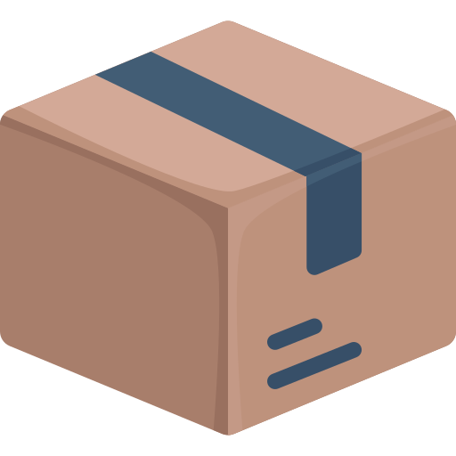

<h1>纸箱 | Zhixiang</h1>

多平台游戏资源包封装格式 | Multi-platform game assets package format

## 组成 | Components

- 核心库
- 命令行工具（用于打包、解包）
- 服务端（以 http 方式读取资源）

## 格式定义 | Format

See [docs/format.md](docs/format.md)

## Credits

- [Carton icons created by QudaDesign - Flaticon](https://www.flaticon.com/free-icons/carton)

## 许可

MIT OR Apache-2.0
